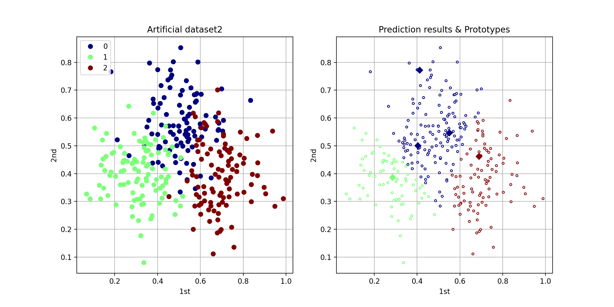
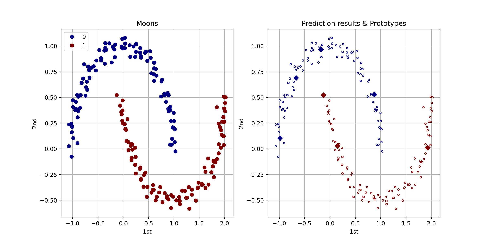

# Self-incremental learning vector quantization

This implementation is based on the below paper.
Self-incremental learning vector quantization with human cognitive biases (https://www.nature.com/articles/s41598-021-83182-4).

Compatible with Python3.6 and above.

## Requirements

- NumPy
- scikit-learn
- matplotlib

## Quickstart

This is the minimum code to run SilvqModel.

```python
import numpy as np
from sklearn.metrics import accuracy_score
from sklearn.model_selection import train_test_split
from sklearn.datasets import load_iris
from lvq import SilvqModel

# Load dataset
iris = load_iris()
x = iris.data
y = iris.target
# Split dataset into training set and test set
x_train, x_test, y_train, y_test = train_test_split(x, y, test_size=0.2, random_state=8, shuffle=True, stratify=y)

# Generating model
model = SilvqModel(x.shape[1], theta=0.8, bias_type='ls')
# Training the model
model.fit(x_train, y_train, epochs=1)
# Predict the response for test dataset
y_predict = model.predict(x_test)

# Evaluating the model
print('Accuracy: %.3f' %accuracy_score(y_test, y_predict))
```

For more information, [score_iris_silvq.py](score_iris_silvq.py).

## Techniques

The following techniques can be used to improve accuracy.

```python
from lvq import SilvqModel
from lvq.utils import choice_prototypes

initial_prototypes = choice_prototypes(x_train, y_train, prototypes_per_class=1, random_state=None)
model = SilvqModel(x.shape[1], theta=0.5, bias_type='ls', initial_prototypes=initial_prototypes)
model.fit(x_train, y_train, epochs=30)
```

For more information, [score_wine_silvq.py](score_wine_silvq.py).

## Data compression & noise reduction

You can use this model to perform data compression and noise reduction.

```python
import numpy as np
from sklearn.metrics import accuracy_score
from sklearn.model_selection import train_test_split
from sklearn.datasets import load_breast_cancer
from lvq import SilvqModel

# Load dataset
breast_cancer = load_breast_cancer()
x = breast_cancer.data
y = breast_cancer.target
# Split dataset into training set and test set
x_train, x_test, y_train, y_test = train_test_split(x, y, test_size=0.2, random_state=8, shuffle=True, stratify=y)

# Generating model
model = SilvqModel(x.shape[1], theta=0.5, bias_type='ls')
# Training the model
model.fit(x_train, y_train, epochs=30)
# Predict the response for test dataset
y_predict = model.predict(x_test)

# Evaluating the model
print('** Original *****************************')
print('Accuracy: %.3f' %accuracy_score(y_test, y_predict))
print('Number of prototypes: {}'.format(model.n_prototypes))

# Noise reduction
model.delete_prototype(140)
# Predict the response for test dataset
y_predict = model.predict(x_test)

# Evaluating the model
print('** Noise reduction *********************')
print('Accuracy: %.3f' %accuracy_score(y_test, y_predict))
print('Number of prototypes: {}'.format(model.n_prototypes))
```

For more information, [export_compression_artificial_dataset2_silvq.py](export_compression_artificial_dataset2_silvq.py), [export_compression_and_noise_reduction_artificial_dataset2_silvq.py](export_compression_and_noise_reduction_artificial_dataset2_silvq.py), and [score_noise_reduction_breast_cancer_silvq.py](score_noise_reduction_breast_cancer_silvq.py).

## Plot prototypes

You can use plot2d to visualize the prototype of SilvqModel.

```python
from lvq.utils import plot2d
plot2d(model, x, y)
```

The plot shows the target class of each data point (big circle) and which class was predicted (smaller circle).
It also shows the prototypes (diamond).

<p align='center'>
    
</p>

For more information, [plot2d_artificial_dataset1_silvq.py](plot2d_artificial_dataset1_silvq.py).

<p align='center'>
    
</p>

For more information, [plot2d_artificial_dataset2_silvq.py](plot2d_artificial_dataset2_silvq.py).

<p align='center'>
    
</p>

For more information, [plot2d_moons_silvq.py](plot2d_moons_silvq.py).

## Note
Self-incremental learning vector quantization (SILVQ) provides a learning algorithm that can be intuitively understood. To improve SILVQ performance, distances other than the Euclidean distance, such as cosine distance, may be used instead. As with advanced LVQ algorithms designing models to strictly minimize classification errors may be possible. However, human learning is variable and compound; it is not exclusively based on minimizing the classification errors.

This research aims to contribute to both the computer science and cognitive science fields and hopes to support the research of explainable artificial intelligence (XAI) to address the black box problem of machine learning.

## License
This is free and open-source software licensed under the 3-clause BSD license.
